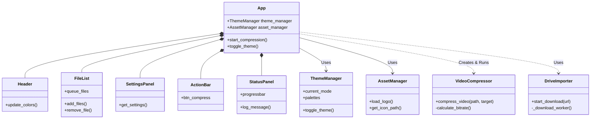
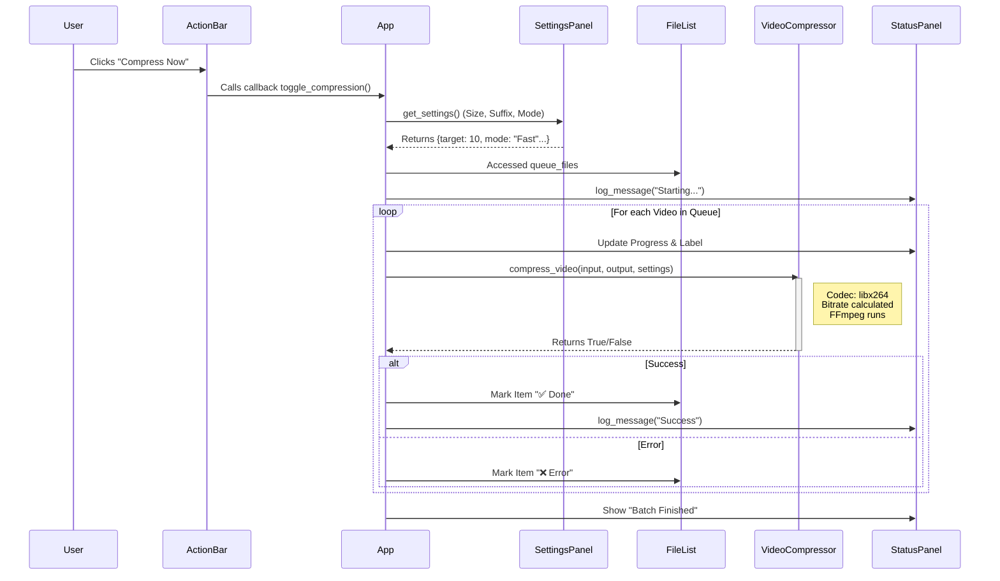

# Project Architecture & Design Documentation

This document provides a comprehensive technical overview of the **ITG Video Compressor** codebase. It combines a high-level structural breakdown with an in-depth analysis of the design patterns and data flows used.

---

## 📑 Table of Contents
1.  [High-Level Architecture](#1-high-level-architecture)
2.  [File Structure Breakdown (The Tables)](#2-file-structure-breakdown)
3.  [Class & Component Diagram](#3-class--component-diagram)
4.  [Data Flow: Compression Lifecycle](#4-data-flow-compression-lifecycle)
5.  [Design Principles & Patterns](#5-design-principles--patterns)
6.  [Detailed Technical Analysis](#6-detailed-technical-analysis)

---

## 🏗️ 1. High-Level Architecture

The application is built using **Python** with the **CustomTkinter** framework for the GUI. It follows a **Modular Component-Based Architecture**, separating the User Interface (UI), Business Logic, and Utilities.

### Core Layers
1.  **Presentation Layer (`src/ui/`)**: Handles everything the user sees and interacts with. It's further split into reusable widgets.
2.  **Application Logic Layer (`src/app.py`)**: Acts as the "Controller" or "Assembler." It initializes the main window, ties components together, and manages the global application state.
3.  **Business Logic Layer (`src/compressor.py`)**: Contains the core domain logic—video compression using `ffmpeg` and `moviepy`. This layer knows nothing about the UI.
4.  **Infrastructure/Utility Layer (`src/utils/`)**: Provides helper services like Google Drive downloading and asset management.

---

## 📂 2. File Structure Breakdown

### **Root Directory**
| File | Responsibility |
| :--- | :--- |
| `main.py` | **Entry Point**. It sets up the system path and launches the `App`. Keep this file simple. |
| `PROJECT_STRUCTURE.md` | A quick tree view of the folders. |

### **`src/` Directory (The Core)**
| File | Responsibility |
| :--- | :--- |
| `app.py` | **Main Application Controller**. It inherits from `CTk`, creates the main window, initializes all child components (Header, FileList, etc.), and coordinates communication between them. |
| `compressor.py` | **Domain Logic**. The `VideoCompressor` class lives here. It handles file I/O, calculates bitrates, and runs the compression commands. |

### **`src/ui/` Directory (User Interface)**
| File | Responsibility |
| :--- | :--- |
| `styles.py` | **Theme Management**. Contains the color palettes (Light/Dark mode definitions) and the `ThemeManager` class. |

#### **`src/ui/widgets/` (Reusable Components)**
| Widget File | Responsibility |
| :--- | :--- |
| `header.py` | Displays the Logo, Title, and Theme Toggle button. |
| `file_list.py` | Manages the list of selected videos. It handles adding/removing items and displaying their status (Pending/Done). |
| `settings.py` | Contains input fields for Target Size, Suffix, and Output Folder. Encapsulates validation logic. |
| `action_bar.py` | Holds the primary action buttons ("Compress Now", "Refresh"). Exposes events like `on_compress`. |
| `status_panel.py` | Shows the global progress bar, status text, and the scrolling log viewer. |

### **`src/utils/` Directory (Helpers)**
| File | Responsibility |
| :--- | :--- |
| `assets.py` | **Resource Management**. Handles locating and loading images/icons safely (works in both dev and PyInstaller exe modes). |
| `drive_importer.py` | **External Integration**. Encapsulates the logic for downloading files from Google Drive using `gdown`. |

---

## 📊 3. Class & Component Diagram

The following diagram shows how the classes interact. The `App` class sits at the center, coordinating the UI components and the Logic.

**Key Takeaway**: `App` acts as the "Glue" or Facade. Components don't talk to each other directly; they talk to `App`.

---

## 🔄 4. Data Flow: Compression Lifecycle

This sequence illustrates the lifecycle of a user clicking "Compress".

---

## 🛡️ 5. Error Handling Strategy

To ensure a robust user experience, we employ a multi-layered error handling approach:

1.  **Input Validation Layer (`SettingsPanel`)**:
    *   Prevents invalid data from ever reaching the logic layer.
    *   *Example*: Ensures "Target Size" is a positive number numbers before enabling the "Compress" button (logic handled in validation checks).

2.  **Logic Layer Protection (`VideoCompressor`)**:
    *   Wraps critical `ffmpeg` calls in `try-except` blocks.
    *   catches specific exceptions (e.g., `FileNotFoundError`, `PermissionError`) rather than generic ones where possible.
    *   Returns boolean status (`True`/`False`) to the caller, pushing the *choice* of how to display the error up to the UI.

3.  **UI Feedback Layer (`StatusPanel`)**:
    *   Visual Indicators: Turns specific queue items Red on failure.
    *   Logging: Writes explicit error messages to the scrolling log view for debugging (e.g., "Error: Access Denied").

---

## ⚡ 6. Performance Considerations

*   **Concurrency**:
    *   The `App` uses the `threading` module to offload `ffmpeg` processes.
    *   The main **UI Thread** is never blocked for more than a few milliseconds.
*   **Memory Management**:
    *   We do *not* load the entire video into RAM. `moviepy` and `ffmpeg` stream the data layer-by-layer.
    *   Large assets (GUI images) are loaded once and cached in `AssetManager`.
*   **Lazy Loading**:
    *   Components are initialized only when the App starts.

---

## 🔒 7. Security Best Practices

*   **Path Sanitization**:
    *   We use `os.path.normpath` and `os.path.join` to prevent path traversal attacks, ensuring output files are strictly written where intended.
*   **Dependency Management**:
    *   The project uses a pinned `requirements.txt` to avoid unexpected malicious updates from upstream packages.
*   **No Remote Execution**:
    *   The app does not execute arbitrary remote code. `drive_importer` only downloads files; it does not "run" them.

---

## 🧹 8. Coding Standards & Style

*   **PEP 8**: The codebase follows standard Python style guidelines.
*   **Type Hints**: We aim to use Python Type Hinting (`def function(x: int) -> bool:`) to improve IDE autocomplete and reduce type errors.
*   **Docstrings**: Critical classes and methods have docstrings explaining their arguments and return values.

---

## 🎨 9. Design Principles & Patterns

### A. Object-Oriented Programming (OOP)
The entire UI is structured using OOP.
- **Encapsulation**: Each component (e.g., `Header`, `FileList`) is a Class.
- **Inheritance**: Widgets inherit from `CTkFrame`, reusing base behavior.

### B. Facade Pattern
**Where**: `src/app.py` (The `App` Class)
**In Code**: `main.py` calls `app = App()`. The `App` class internally handles all complexity: initializing themes, loading assets, and laying out 5 sub-panels.
**Why**: Keeps `main.py` clean (2 lines of code).

### C. Observer Pattern (Simplified)
**Where**: Theme Switching (`toggle_theme`)
**In Code**: When `App.toggle_theme()` is called, it updates `ThemeManager`, then explicitly notifies all child components to `update_colors()`.
**Why**: Decouples color logic. Widgets know *how* to change color, but `App` decides *when*.

### D. Dependency Injection (DI)
**Where**: Passing `ThemeManager` to Widgets
**In Code**: `Header(..., self.theme_manager, ...)`.
**Why**: Ensures all 5 widgets share the exact same `ThemeManager` instance. Memory efficient and consistent.

### E. Single Responsibility Principle (SRP)
- **`app.py`**: Assembly and orchestration.
- **`compressor.py`**: Pure video logic. No UI code.
- **`styles.py`**: Pure design/color definitions.

---

## 🔬 6. Detailed Technical Analysis

### `src/app.py` (The Controller)
*   **Role**: The brain of the operation.
*   **Threading**: `run_batch_compression()` runs in a separate thread to keep the GUI responsive.
*   **Thread-Safety**: Uses `.after(0, ...)` to update the UI from the background thread.

### `src/compressor.py` (The Worker)
*   **Role**: The heavy lifter using `moviepy`.
*   **Bitrate Formula**: `(TargetSize * 0.9) / Duration`. Allocates 90% of size to video track.

### `src/utils/assets.py` (The Resource Loader)
*   **Role**: Safe Path Management.
*   **Feature**: Handles `sys._MEIPASS` to ensure images load correctly when bundled as an `.exe`.

---

## 🚀 Future Scalability

*   **Web Version**: Reuse `src/compressor.py`.
*   **CLI Version**: Reuse `src/compressor.py`.
*   **New Widgets**: Add to `src/ui/widgets/` and import in `app.py`.
